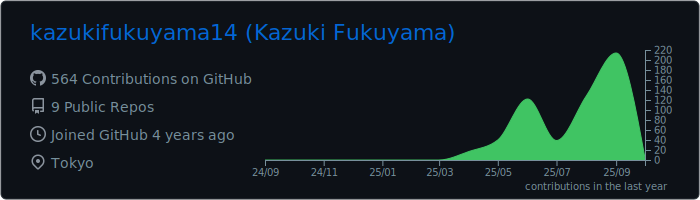
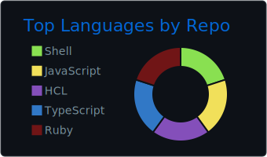
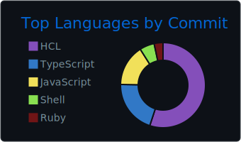
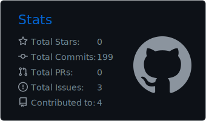
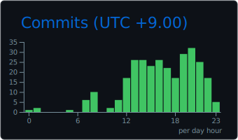

# GitHub Dark

[](https://github.com/vn7n24fzkq/github-profile-summary-cards)
[](https://github.com/vn7n24fzkq/github-profile-summary-cards)
[](https://github.com/vn7n24fzkq/github-profile-summary-cards)
[](https://github.com/vn7n24fzkq/github-profile-summary-cards)
[](https://github.com/vn7n24fzkq/github-profile-summary-cards)

## Now you can add this to your markdown

```markdown
[](https://github.com/vn7n24fzkq/github-profile-summary-cards)
[](https://github.com/vn7n24fzkq/github-profile-summary-cards) 
[](https://github.com/vn7n24fzkq/github-profile-summary-cards)
[](https://github.com/vn7n24fzkq/github-profile-summary-cards) 
[](https://github.com/vn7n24fzkq/github-profile-summary-cards)
```

## Each card usage

---


```markdown

```

---


```markdown

```

---


```markdown

```

---


```markdown

```

---


```markdown

```
